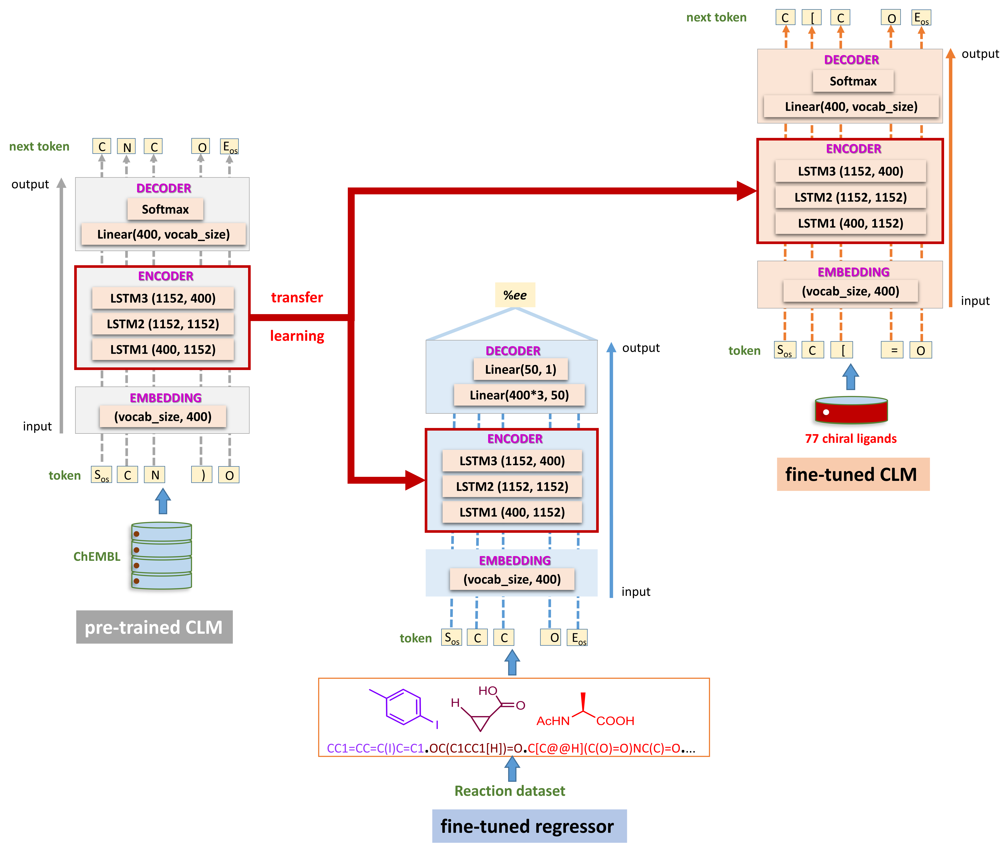

# EnsembleAC
Ensemble Deep Learning for Asymmetric Catalysis

## Overview
\

## Significance
The development of robust machine learning (ML) models for real-world reaction data can greatly enhance the current research efforts in asymmetric catalysis, where the objective is to selectively produce a desired stereoisomer (enantiomer) with high selectivity. This work addresses one of the key hurdles in reaction discovery with a relatively smaller data set, by integrating an ensemble DL model with wet-lab experimental validation, thus making it a practically useful tool. The results are significant as it deals with challenging situations of sparse and imbalanced data sets belonging to a prototypical asymmetric catalytic reaction. While our prospective validation of ML-generated reactions remains largely successful in reinforcing the fact that DL can effectively inform and guide reaction development, it also underscores the importance of having domain experts in vital decision-making.

### Prerequisites
- Python 3.7.16 (Anaconda)
- PyTorch 1.12.1
- CUDA 11.3

### Environmental Setup

```
conda create --name EnsembleAC python=3.7.16
conda activate EnsembleAC
conda install pytorch==1.12.1 torchvision==0.13.1 torchaudio==0.12.1 cudatoolkit=11.3 -c pytorch
pip install -r requirements.txt
```
### Git repository
Please clone two existing repositories (fastai and synthetic complexity score) after creating your environment with Python 3.7.16.
```
https://github.com/fastai/fastai1.git
https://github.com/connorcoley/scscore.git
```
# Project Notebooks Overview

This repository contains a series of Jupyter notebooks for building deep learning models, generating novel ligands, and performing %ee predictions.

## Notebooks

1. **Train Ensemble Predictive Model**
   - Use the `Training_Ensemble_TL_Regressor.ipynb` notebook to train the ensemble prediction (EnP) model for predicting %ee of reactions.
   
2. **Generate Novel Ligands via Transfer Learning**
   - Leverage the `TL_Generative.ipynb` notebook to generate novel ligands using fine-tuned generator (FnG).

3. **Predict Reactions for Novel Ligands**
   - Apply the `Ensemble_TL_Regressor_For_Novel_Reactions.ipynb` notebook to predict %ee of reactions from the newly generated set of ligands.

4. **Generate Comparison Plots**
   - The `Plots_Generated_Vs_Experimental.ipynb` and `Plots_SA&SC_Score.ipynb` notebooks are used for creating various comparison plots between the generated set and training set, including synthetic complexity scores and physicochemical properties.

### Acknowledgements

### Citations
